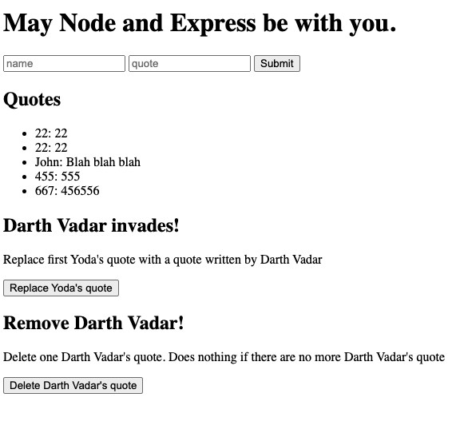

# Simple-Crud-App-Tutorial
Simple CRUD APP tutorial. 

 

## How It's Made:

**Tech used:** HTML, CSS, JavaScript, Nodejs, MongoDb

This project was made using Vanilla Javascript and is built as part of the homework for Class 38 of 100 Devs.

